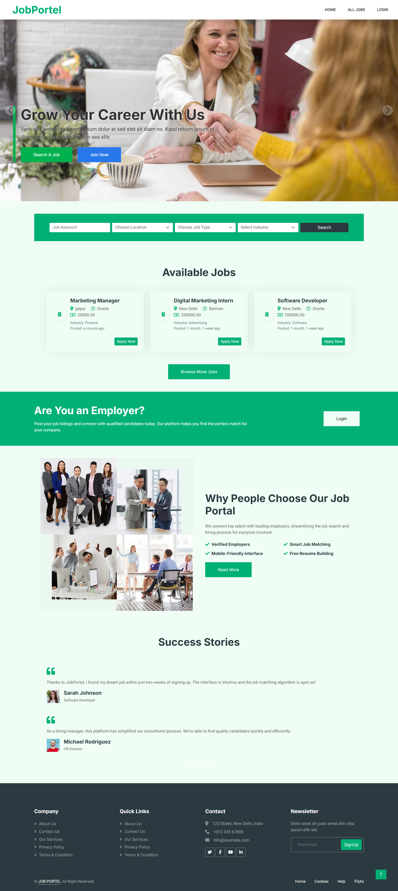
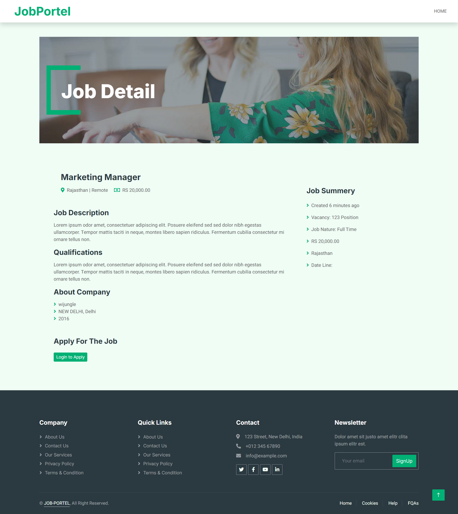
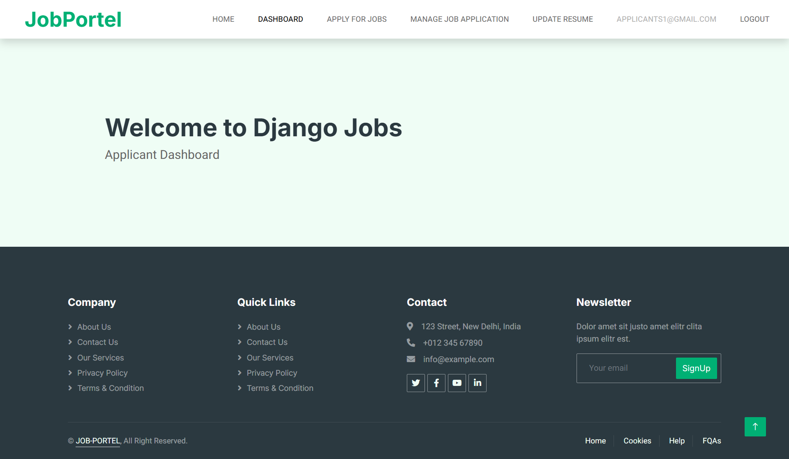
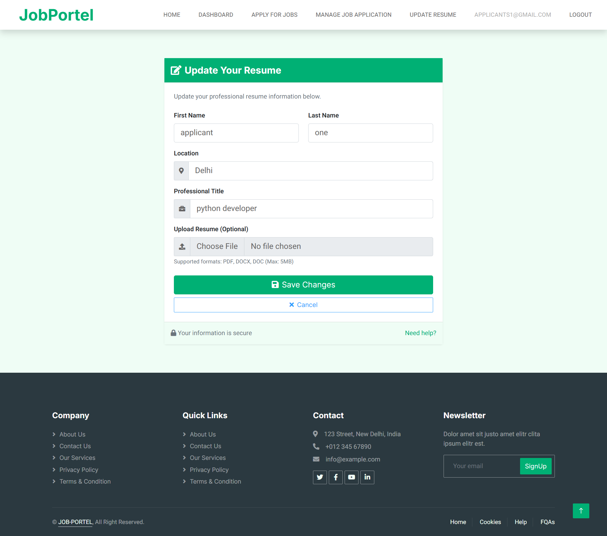
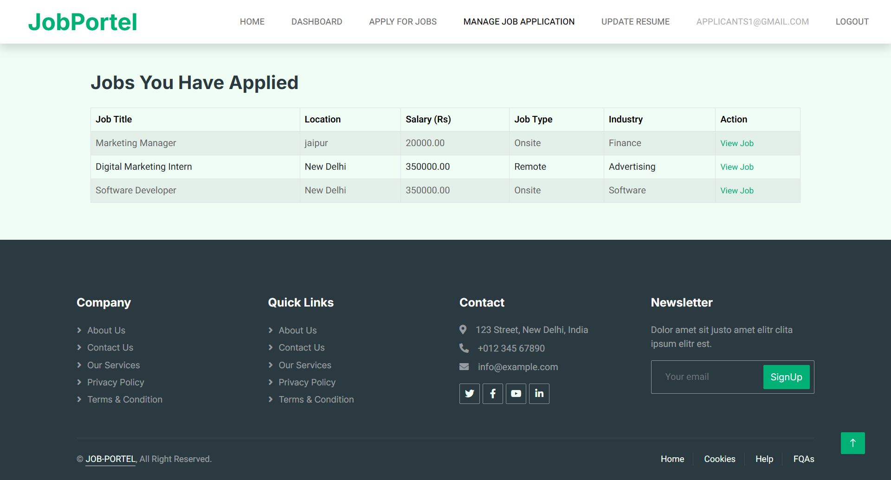
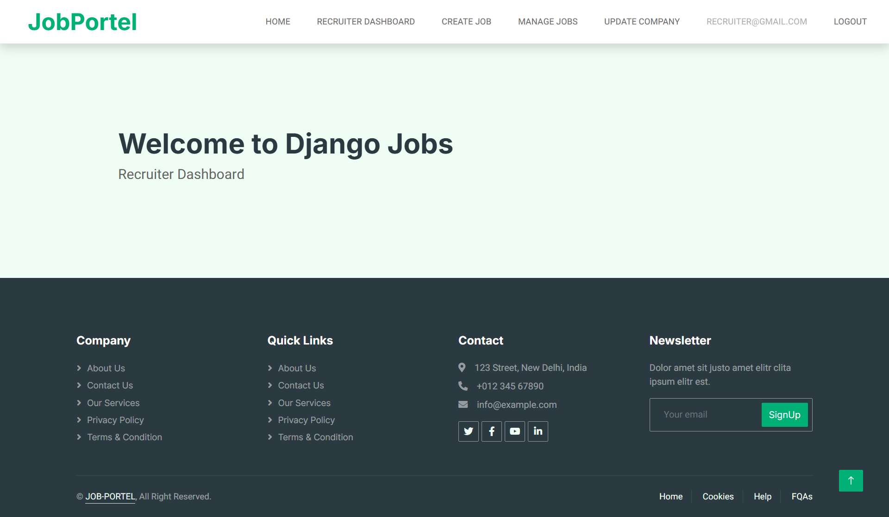
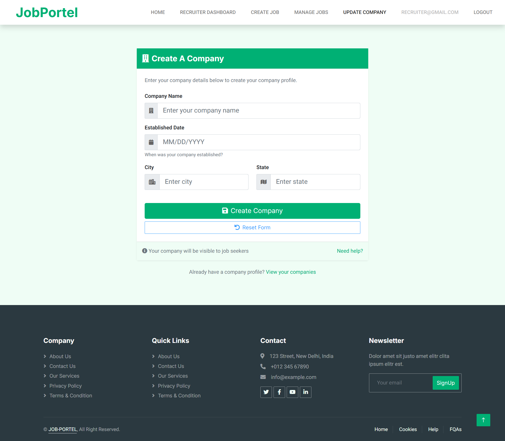
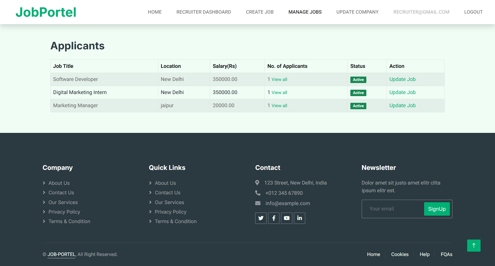

# Job Portal
Django Job Portal.   

## Installation 

```
open terminal and type


or simply download using the url below

```
## Create & Activate a Virtual Environment
```
python -m venv venv
source venv/bin/activate  # On macOS/Linux
venv\Scripts\activate     # On Windows
```

## Install requirements

```
pip install -r requirements.txt
```
## Database

```
Set the database from settings.py
```

## To migrate the database open terminal in project directory and type
```
python manage.py makemigrations
python manage.py migrate
```
## Run the server
```
python manage.py runserver
```
---

## 📸 Screenshots

### 🏠 Home Page


### 📋 Job Listings


### 📄 Job Detail Page


### 📊 Applicants Dashboard


### 📝 Create Resume


### 👩‍💼 Applied Jobs


### 📊 Recruiter Dashboard


### 🏢 Create Company


### 📋 Applicants List



<div align="center">
    <h3>========Thank You=========</h3>
</div>